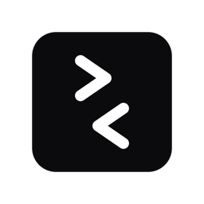
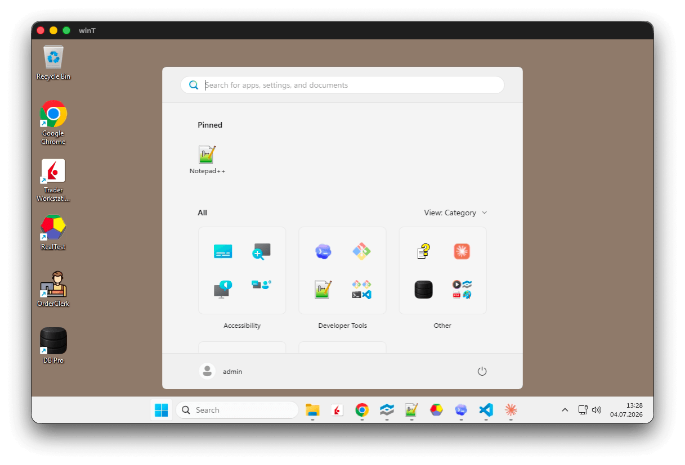
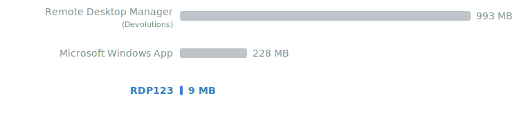
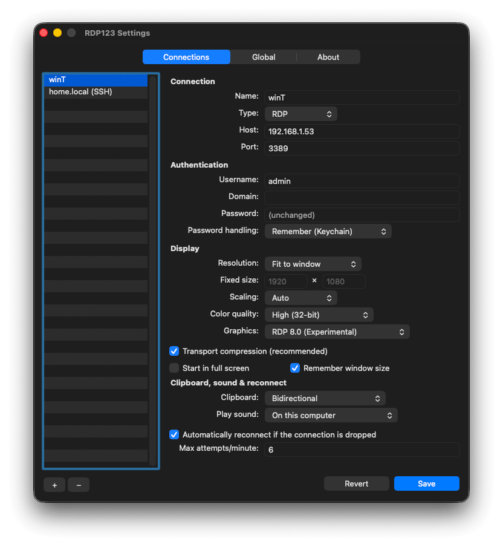

<p align="center">
  
</p>

<h1 align="center">RDP123</h1>

<p align="center">
  A minimal, fast, and responsive <strong>RDP client for macOS</strong>, built in Rust.
</p>

<p align="center">
  
  <a href="LICENSE"></a>
  
  
  <a href="#privacy"></a>
</p>

<p align="center">
  <a href="#features">Features</a> ·
  <a href="#build--install">Build</a> ·
  <a href="#usage">Usage</a> ·
  <a href="#security">Security</a> ·
  <a href="#privacy">Privacy</a> ·
  <a href="#credits">Credits</a>
</p>

RDP123 lives in the menu bar and opens each saved connection in a clean native
window. While sessions are open, they appear in the Dock and ⌘-Tab; when the
last one closes, the app quietly returns to the menu bar.

<p align="center">
  
</p>

## Why RDP123

**Native and small.** RDP123 is an AppKit application written in Rust with
`objc2`: no Electron and no bundled browser. Microsoft Entra login uses the
system WebKit framework only while authenticating. The installed app is about
9 MB, with a near-zero idle footprint.

<p align="center">
  
</p>

Sizes above are installed sizes measured in mid-2026. RDP123 deliberately
focuses on everyday remote access rather than enterprise-management features.

**Built for low latency.** The first update after an idle period is presented
immediately. Bursts are coalesced in an 8 ms window, allowing sustained streams
up to 120 fps on ProMotion displays. Dirty-region tracking moves only changed
pixels, while pooled IOSurfaces let CoreAnimation present frames without
per-frame image allocation, full-frame copies, or texture uploads.

**Two graphics pipelines.** Classic RDP 6.1 graphics is the reliable default.
The selectable, experimental RDP 8 pipeline supports H.264/AVC420, RemoteFX
Progressive, ClearCodec with NSCodec, Planar, cache-driven compositing, and
automatic ZGFX compression. Its decoders were checked against the reference
implementation and include narrowly scoped fixes for upstream issues.

## Features

- **Native multi-session workflow** — sessions appear individually in the Dock
  and ⌘-Tab. Right-click the Dock icon to list and raise open sessions; the
  frontmost session is marked.
- **Responsive remote windows** — native title bar, font smoothing, Retina/
  HiDPI-aware dynamic resizing, fixed resolutions, remembered window size, and
  full screen.
- **Native remote cursor** — server resize arrows, I-beam, hand, and other
  pointer shapes are applied to the macOS cursor without server-drawn lag.
- **Clipboard and files** — bidirectional text and file copy/paste, including
  folders. File data streams on demand without an application-imposed size
  limit; clipboard access can be restricted or disabled per connection.
- **Remote audio** — play Windows audio on the Mac (default), leave it on the
  remote computer, or disable it per connection.
- **Reliable keyboard input** — physical scan-code mapping supports non-US
  layouts such as Swiss German and releases modifiers safely when switching
  applications.
- **Wake on LAN and keep-alive** — optionally wake a host by MAC address and
  prevent idle policy lockouts with an invisible key tap. Both are configured
  per connection and keep-alive is off by default.
- **Password or Microsoft Entra authentication** — password-based NLA uses the
  macOS Keychain. Entra web authentication supports joined Windows 11 hosts and
  is equivalent to `enablerdsaadauth:i:1`; tokens and the ephemeral
  proof-of-possession key remain in memory.
- **Native Settings** — manage RDP and SSH entries without editing config files.
  Configure display, colour depth, scaling, graphics, compression, clipboard,
  audio, authentication, reconnect behavior, and password handling. The About
  tab shows the exact installed version.
- **SSH shortcuts** — keep SSH hosts beside RDP connections and open them in
  your preferred terminal using your existing SSH keys and configuration.

## Requirements

- macOS 11 or newer on Apple Silicon or Intel.
- Xcode Command Line Tools: `xcode-select --install`.
- Rust 1.89 or newer via [rustup](https://rustup.rs).
- A Windows host accepting password-based NLA or RDS AAD Auth. Entra mode
  requires the device hostname, not an IP address.

## Build & install

RDP123 has no prebuilt download. A ready-made macOS binary would require a paid
Apple Developer account for notarization; a local build needs no Apple account,
does not receive a quarantine flag, and makes the running source explicit.

```sh
git clone https://github.com/asd123ch/rdp123.git
cd RDP123
scripts/make-signing-identity.sh   # one-time: stable local signing identity
cargo xtask install                # release build, sign, install in /Applications
open /Applications/RDP123.app
```

`cargo xtask install` installs the only app copy at `/Applications/RDP123.app`.
Use `cargo xtask bundle` to create `dist/RDP123.app` without installing. Both
commands use the locally generated **RDP123 Local** identity when available and
otherwise fall back to an ad-hoc signature (`-`). The bundle includes the
AGPLv3 license under `Contents/Resources`.

### Stable local signing

Running `scripts/make-signing-identity.sh` once is strongly recommended. macOS
ties the Keychain **Always Allow** decision and **Local Network** permission to
the app's code identity. An ad-hoc identity changes with every build, causing
repeated prompts and potentially a failed first LAN connection after rebuilding.

The script is non-interactive, free, and requires no Apple account. It creates
a self-signed **RDP123 Local** certificate with a non-extractable private key in
a dedicated keychain; it never uses your login keychain.

<details>
<summary>Signing internals, removal, and custom identities</summary>

The signing keychain is
`~/Library/Keychains/rdp123-signing.keychain-db`. Its random password is kept in
a user-only file at
`~/Library/Application Support/RDP123/signing-keychain-password`, and only
Apple's signing tools are authorized to use the private key. The build unlocks
this keychain automatically without a GUI prompt.

Remove the local identity with:

```sh
security delete-keychain ~/Library/Keychains/rdp123-signing.keychain-db
rm -f "$HOME/Library/Application Support/RDP123/signing-keychain-password"
```

Use your own identity with
`RDP123_SIGN_IDENTITY="My Identity" cargo xtask bundle`. A local build remains
unnotarized, which is unnecessary when running it on the Mac that built it.

</details>

### First connection prompts

- **Local Network:** click **Allow** when macOS asks whether RDP123 may find
  local devices. RDP123 briefly retries TCP reachability after approval, but
  never retries authentication, certificate, or protocol failures, avoiding
  accidental account lockouts.
- **Keychain:** with stable signing, save a password and click **Always Allow**
  once. If macOS rejects your login password, the login keychain password is
  out of sync; update it in *Keychain Access* → right-click **login** → *Change
  Password for Keychain "login"…*. Choose **Password handling → Always ask**
  to store no password at all.

## Usage

1. On first launch there are no saved connections. Open the menu-bar **RDP**
   item → **Settings…**.
2. Under **Connection**, add an entry with **+**, configure it, and choose
   **Save**. **Revert** discards edits; switching with unsaved changes asks
   before continuing.
3. Under **Global**, choose the SSH terminal, optional ⌘/⌥ swap, and whether
   RDP123 starts at login.
4. Select a saved connection from the menu:
   - **RDP with Password (NLA):** enter or retrieve the password, trust the new
     server key, and connect.
   - **RDP with Microsoft Entra web:** trust the server key and complete the
     Microsoft login and MFA without an RDP password. Use the device hostname.
   - **SSH:** launch `ssh user@host` in the selected terminal.

<p align="center">
  
</p>

### Local data

- Connection names, hosts, options, and pinned server keys:
  `~/Library/Application Support/ch.asd123.RDP123/connections.json`.
- Passwords: macOS Keychain service `ch.asd123.rdp123`, never the profile file.
- A changed server key is flagged before credentials are sent.

### SSH terminals

SSH entries use your keys and `~/.ssh/config`. Select a terminal under
**Settings → Global**.

<details>
<summary>Supported terminal launch methods</summary>

- **Terminal.app / iTerm2:** AppleScript through `osascript`.
- **Kaku / WezTerm:** `<cli> start -- ssh …`; binaries are found on `PATH`, in
  Homebrew locations, or inside the application bundle.
- **Ghostty / Alacritty:** `open -na <App> --args -e ssh …`.
- **Custom:** a `/bin/sh -c` template with `{ssh}`, `{host}`, `{port}`, and
  `{user}` placeholders.

</details>

### Keyboard and Karabiner

RDP123 sends physical scan codes directly, so Windows shortcuts work without a
remapping tool. If you use
[Karabiner-Elements](https://karabiner-elements.pqrs.org), add
`^ch\.asd123\.rdp123` to rule exclusion lists so sessions receive raw keys. The
author's [Karabiner configuration](https://github.com/patrickdobler/karabiner-config)
already does this.

For PC key positions inside sessions, enable **Settings → Global → Swap ⌘ and
⌥**. Then ⌘ acts as Alt and ⌥ as the Windows key. It is off by default.

## Security

- **Passwords:** macOS Keychain only; never profiles or logs.
- **Transport:** TLS 1.2+ through rustls with either NLA (CredSSP/NTLM) or RDS
  AAD Auth, negotiated before the session starts.
- **Entra:** access tokens are bound to a fresh 2048-bit RSA
  proof-of-possession key. Tokens and private keys remain in process memory.
- **Server identity:** on first connection, RDP123 displays the server public
  key's SHA-256 fingerprint before sending credentials. The key is pinned and a
  later mismatch is reported. Pinning the key rather than the certificate
  avoids prompts for routine certificate renewals using the same key.
- **Reduced attack surface:** no listening ports or drive, printer, microphone,
  or smart-card redirection. Clipboard and remote audio are optional.

## Privacy

- No telemetry, analytics, crash reporting, advertising, tracking, accounts,
  automatic updates, hosted control plane, or hidden background listener.
- No data is sent to the developer. RDP connects only to the configured host;
  SSH invokes the local client; Entra mode contacts
  `login.microsoftonline.com` for Microsoft authentication and its RDP token.
- Profiles remain in Application Support and passwords in the Keychain.
  Clipboard and audio move only when enabled for that connection.

There are intentionally no prebuilt notarized binaries. Review the source and
dependencies before building any remote-access software. The signing helper
only provides a stable local identity and never contacts Apple.

## Architecture

- **`rdp123-core`:** profiles, Keychain integration, RDP engine, input, resize,
  clipboard, shared framebuffer, and macOS-to-RDP scan-code mapping. It is
  unit-tested without AppKit.
- **`rdp123-app`:** native AppKit UI, menu-bar and Dock integration, windows,
  IOSurface/CoreAnimation rendering, input, and system-WebKit Entra login.

Each session owns a thread with a single-threaded Tokio runtime. Commands move
to the session over a channel; frame, clipboard, trust, and disconnect events
return to the main thread through GCD. The session never touches AppKit and the
UI never speaks RDP.

## Known limitations

- Tested primarily with current Windows 10/11 hosts over direct connections;
  RDS farms and gateways may have rough edges.
- Entra authentication currently targets the public Microsoft cloud; sovereign
  cloud endpoints are not configurable.
- Experimental RDP 8 graphics can show compositing artifacts; Classic remains
  the reliable default.
- Clipboard images, microphone input, multi-monitor, and console/admin sessions
  are not implemented. Audio is remote-to-local uncompressed PCM only.

## Development

Issues and focused pull requests are welcome. Do not attach credentials,
hostnames, captured RDP traffic, or private desktop screenshots. Keep vendored
IronRDP changes narrow and documented for future upstreaming or rebasing.

CI checks formatting, tests, Clippy, Intel compilation, and dependencies:

```sh
cargo fmt --all -- --check
cargo test --workspace --all-targets --locked
cargo clippy --workspace --all-targets --all-features --locked -- -D warnings
cargo check --workspace --target x86_64-apple-darwin --locked
cargo audit --ignore RUSTSEC-2023-0071 -D warnings
```

`RUSTSEC-2023-0071` is an unavoidable transitive advisory in the current
IronRDP/SSPI graph. It concerns RSA private-key operations; password-based NTLM
does not load an RSA private key, while Entra proof-of-possession signing uses
AWS-LC rather than the affected transitive implementation. The explicit
exception keeps other advisories visible and can be removed after an upstream
update.

## Credits

- [IronRDP](https://github.com/Devolutions/IronRDP) — RDP protocol, channels,
  and graphics pipeline.
- [rustls](https://github.com/rustls/rustls) and
  [AWS-LC](https://github.com/aws/aws-lc-rs) — TLS and cryptography.
- [Tokio](https://github.com/tokio-rs/tokio) — asynchronous networking.
- [objc2](https://github.com/madsmtm/objc2) — native Apple-framework bindings.
- [OpenH264](https://github.com/cisco/openh264),
  [openh264-rs](https://github.com/ralfbiedert/openh264-rs), and
  [CPAL](https://github.com/RustAudio/cpal) — AVC420 and audio playback.
- RustCrypto, serde, tracing, and the wider Rust ecosystem.

Third-party copyright remains with its authors. `Cargo.lock` and crate metadata
record the locked dependency versions and licenses. Modified vendored IronRDP
components retain their MIT/Apache-2.0 license files under `vendor/`.

## License

Copyright (c) 2026 asd123.ai

RDP123 is licensed under the
[GNU Affero General Public License, version 3](LICENSE). You may use, study,
modify, and redistribute it under those terms. If you make a modified version
available to others over a network, you must also offer its corresponding
source. Third-party components remain under their own licenses.
